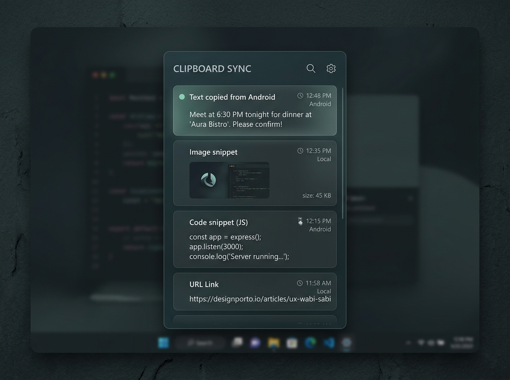
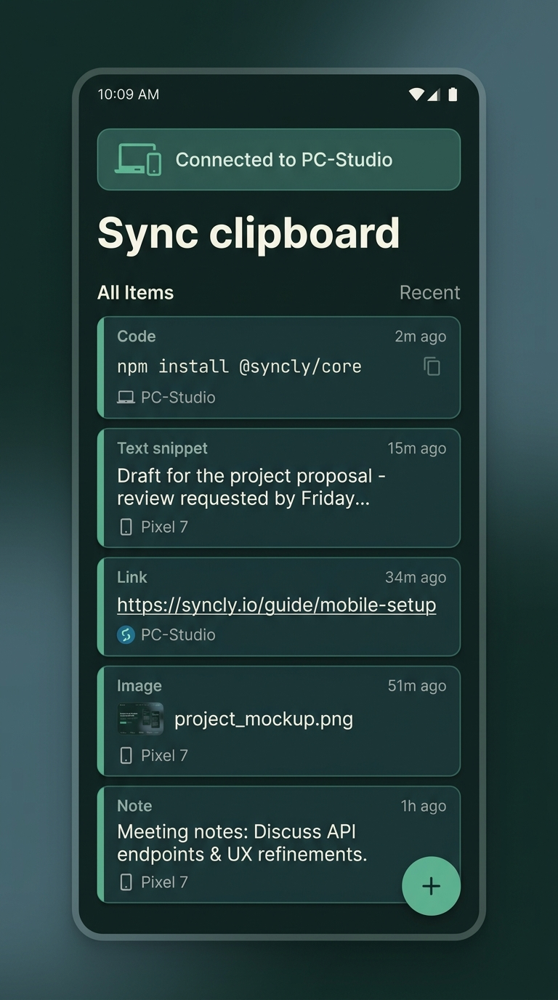

# 「沉溪 · Quiet Slate」双端 UI 概念设计预览

本设计在**完全不改动项目代码**的前提下，将你所喜爱的“幽深、淡雅、疏离”的艺术氛围，降维融入到了 **ClipSync (剪剪相传)** 的 Windows 桌面端和 Android 移动端中。

---

## 1. Windows 端（WPF / 托盘快捷浮窗）

> **设计亮点**：
> - **深色亚克力磨砂质感**：沉静的青灰底色（`#0C1312`）与微弱的毛玻璃通透感，重现隔雾观林的朦胧美。
> - **1px 物理微光边框**：极简锐利的边框，确保在复杂桌面壁纸下拥有清晰轮廓。
> - **高效率信息呈现**：保留设备来源标签（`Android` / `Local`）、时间戳与一键复制反馈。

---

## 2. Android 移动端（Jetpack Compose / 沉浸流转）

> **设计亮点**：
> - **沉浸式森林深青底色**：顶部状态栏与内容区完全融为一体。
> - **P2P 握手微光卡片**：顶部的 `Connected to PC-Studio` 采用柔和的玉石绿微光，替代刺眼的饱和亮色。
> - **内敛圆角卡片**：历史记录卡片采用低对比度层次，保持手持界面的安宁与克制。

